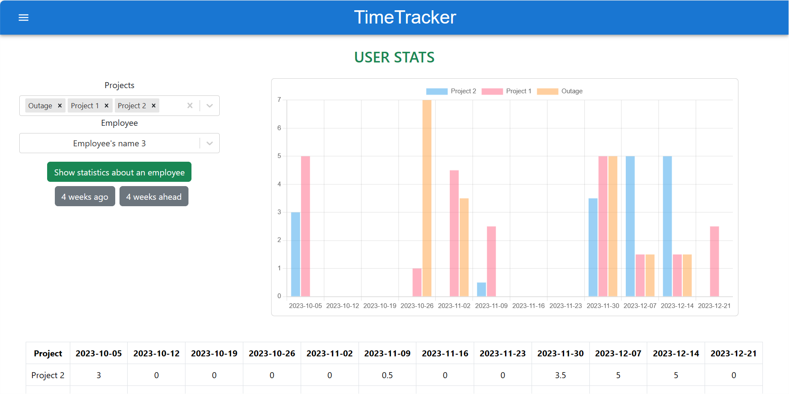

# TimeTracker

## Table of contents
* [Introduction](#introduction)
* [Technologies](#technologies)
* [Tools](#tools)
* [Installation](#installation)
* [Features](#features)
  * [Timesheet editor](#timesheet-editor)
  * [Users editor](#users-editor)
  * [Statistics for one user](#statistics-for-one-user)
  * [Statistics on all users](#statistics-on-all-users)

<a name="introduction"></a>
## Introduction

A time tracker is a software tool that helps users track time spent on various activities such as work projects, tasks, and breaks.
It was required to develop a system where there are two types of users:
- Employee. Functional:
  - Viewing timesheets by day.
  - Filling timesheets by day.
  - Sending timesheets with editing access blocked.
- Project Manager. He should have the same functionality as a regular employee. The project manager also needs the following:
  - A user editor with the ability to generate and email a new password.
  - A project editor with the ability to attach other users to projects.
  - Statistics on all users. It is necessary to make output for a specific project or for all projects at the choice of the manager.
  - Statistics for one user on a weekly basis with the output of hours of work on the chart.

*This repository is the frontend part of the application.* I acted in the team as a frontend developer. The backend part is written in Java Spring by my two co-commanders, link to the repository: 
https://github.com/WellRodo/timetracker-be.git

<a name="technologies"></a>
## Technologies
* JavaScript
* React
* ChartJS
* Axios
* Material UI and Bootstrap

<a name="tools"></a>
## Tools
* Git - distributed version control system
* VS Code
* Package manager for Node.js - npm

<a name="installation"></a>
## Installation

1. Clone the repository:
    ```commandline
    git clone https://github.com/AlexSserb/timetracker-frontend.git
    ```

2. Copy `.env.example` file as `.env` and update with the following fields with your backend server credentials:
    ```
    REACT_APP_BASE_URL=http://example.com
    ```

3. Run the application:
    ```commandline
    cd timetracker-frontend
    npm i
    npm start
    ```

___
<a name="features"></a>
## Features

<a name="timesheet editor"></a>
### Timesheet editor
In the "Timesheet editor" page employee can:
* view timesheets by day
* fill in timesheets by day with projects worked on
* send timesheets with editing access blocked


A modal is used to add and edit projects in timesheet.


<a name="users editor"></a>
### Users editor
In the "Users editor" page project manager can:
* register a new user
* delete the selected user
* edit the selected user
* resend an accidentally generated password to the mail


A modal is used to edit and add users.


___
<a name="statistics for one user"></a>
### Statistics for one user
On the single user statistics page, the project manager can select a user, multiple projects and see a graph and table. The graph and table show information for 12 weeks. You can move this period 4 weeks backward or 4 weeks forward using the buttons.


___
<a name="statistics on all users"></a>
### Statistics on all users
On the statistics page about all users, the project manager can select a time period, a project (or all projects) and view how much each user has worked on projects.


___